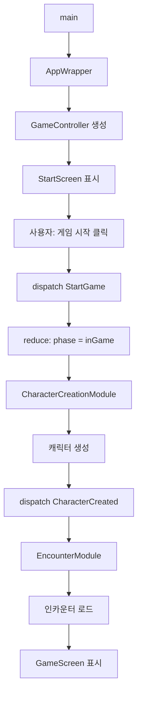
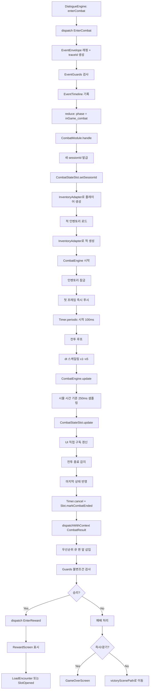

# 시스템 아키텍처 문서

> **프로젝트**: Fantasy Life (텍스트 RPG)  
> **작성일**: 2025-01-27  
> **최종 업데이트**: 2025-01-11 (Combat Tick 최적화 + 이벤트 시스템 개선)  
> **프로젝트 버전**: 1.0.0  
> **기술 스택**: Flutter (Dart), Provider 패턴, 이벤트 기반 아키텍처

---

## 📋 목차

1. [전체 개요](#전체-개요)
2. [아키텍처 패턴](#아키텍처-패턴)
3. [디렉터리 구조](#디렉터리-구조)
4. [핵심 컴포넌트](#핵심-컴포넌트)
5. [데이터 흐름](#데이터-흐름)
6. [모듈 시스템](#모듈-시스템)
7. [주요 시스템](#주요-시스템)
8. [상태 관리](#상태-관리)

---

## 🎯 전체 개요

### 프로젝트 개요

Fantasy Life는 Flutter 기반의 텍스트 RPG 게임입니다. 이벤트 기반 아키텍처와 모듈 패턴을 사용하여 확장 가능하고 유지보수하기 쉬운 구조를 가지고 있습니다.

### 핵심 특징

- **이벤트 기반 아키텍처**: 모든 게임 로직은 이벤트로 표현되고 처리됩니다
- **모듈 패턴**: 기능별로 독립적인 모듈로 분리되어 느슨한 결합을 유지합니다
- **상태 불변성**: `GameVM`은 불변 객체로, 모든 상태 변경은 `reduce()` 함수를 통해 순수하게 처리됩니다
- **의존성 주입**: `GameController`에 모듈을 주입하여 테스트 가능성을 높입니다

### 기술 스택

| 기술 | 용도 |
|------|------|
| Flutter | 크로스 플랫폼 UI 프레임워크 |
| Provider | 상태 관리 (전역 상태) |
| JSON | 게임 데이터 (대화, 인카운터, 아이템) |
| 이벤트 소싱 | 게임 상태 변경 추적 |

---

## 🏗️ 아키텍처 패턴

### 1. 이벤트 기반 아키텍처 (Event-Driven Architecture)

```
┌─────────────────────────────────────────┐
│         GameController (중앙 허브)        │
│  - dispatch(GEvent)                     │
│  - CmdQueue로 직렬 처리                  │
│  - reduce() 상태 전이                    │
│  - 모듈들에게 이벤트 전파                 │
└─────────────┬───────────────────────────┘
              │
    ┌─────────┴─────────────────┐
    │                           │
    ▼                           ▼
┌────────────┐            ┌────────────┐
│ Module A   │            │ Module B   │
│ - handle() │            │ - handle() │
│ - return   │            │ - return   │
│   [Event]  │            │   [Event]  │
└────────────┘            └────────────┘
```

**특징:**
- 모든 이벤트는 `GameController.dispatch()`로 전송
- `CmdQueue`로 이벤트 직렬 처리 (race condition 방지)
- 모듈은 `supportedPhases`와 `handledEvents`만 선언
- 모듈이 새 이벤트 반환 → 재귀적으로 `dispatch()`

### 2. CQRS 패턴 (Command Query Responsibility Segregation)

- **Command (상태 변경)**: `reduce()` 함수로 순수하게 처리
- **Query (상태 조회)**: `GameVM`을 직접 읽기
- **Side Effect**: 모듈의 `handle()` 메서드에서 처리

### 3. 모듈 패턴 (Plugin Architecture)

```dart
abstract interface class GameModule {
  Set<AppPhase> get supportedPhases;      // 지원하는 게임 페이즈
  Set<Type> get handledEvents;            // 처리하는 이벤트 타입
  Future<List<GEvent>> handle(GEvent event, GameVM vm);  // 이벤트 처리
}
```

**장점:**
- 느슨한 결합: 모듈은 서로를 모르고 이벤트만 주고받음
- 확장성: 새 기능은 새 모듈 추가로 구현
- 테스트 용이: 모듈 단위로 독립 테스트 가능

---

## 📁 디렉터리 구조

```
lib/
├── main.dart                          # 앱 진입점
├── app/
│   └── app_wrapper.dart              # Provider 설정, 화면 라우팅
│
├── core/                             # 핵심 게임 로직
│   ├── game_controller.dart          # 이벤트 허브, 모듈 조율
│   ├── state/                        # 게임 상태 모델
│   │   ├── game_state.dart          # GameVM (phase, text, choices, player, combat)
│   │   ├── events.dart               # 이벤트 정의 (StartGame, Next, EnterCombat 등)
│   │   ├── reducer.dart              # 순수 상태 전이 로직
│   │   ├── app_phase.dart            # 게임 페이즈 enum
│   │   └── combat_state.dart         # 전투 상태
│   ├── character/                    # 캐릭터 데이터 모델
│   ├── item/                         # 아이템 데이터 모델
│   ├── infra/                        # 인프라 (command queue, phase gate 등)
│   │   ├── combat_state_slot.dart    # Last-Value 슬롯 (UI 직접 구독)
│   │   ├── event_envelope.dart       # 이벤트 메타데이터 래핑
│   │   ├── event_timeline.dart       # 이벤트 타임라인 (순환 버퍼)
│   │   ├── event_guards.dart         # 런타임 불변조건 검사
│   │   └── combat_metrics.dart        # 전투 성능 메트릭
│   ├── xp/                           # XP 시스템
│   ├── skill_check/                  # 스킬 체크 시스템
│   ├── milestone/                    # 마일스톤 시스템
│   └── ending/                       # 엔딩 시스템
│
├── modules/                          # 게임 기능 모듈 (DI 패턴)
│   ├── character_creation/           # 캐릭터 생성 모듈
│   ├── combat/                       # 전투 모듈
│   ├── encounter/                    # 인카운터 모듈
│   ├── reward/                       # 보상 처리 모듈
│   ├── xp/                           # 경험치/마일스톤 모듈
│   ├── inventory/                    # 인벤토리 모듈
│   └── save/                         # 저장 모듈
│
├── combat/                           # 전투 시스템 구현체
│   ├── combat_system.dart            # 전투 엔진 (타이머 기반)
│   ├── combat_engine.dart            # 전투 엔진 (메인)
│   ├── character.dart                # 전투용 캐릭터 클래스
│   ├── stats.dart                    # 전투 스탯
│   └── ...
│
├── inventory/                        # 인벤토리 시스템 (슬롯/무게 기반)
│   ├── inventory_system.dart         # 메인 시스템
│   ├── inventory_item.dart           # 인벤토리 아이템
│   ├── bag.dart                       # 가방 시스템
│   ├── synergy_system.dart            # 시너지 시스템
│   ├── combat_lock_system.dart       # 전투 중 잠금 시스템
│   └── ...
│
├── dialogue/                         # 대화 시스템
│   ├── dialogue_engine.dart          # 대화 엔진 (메인)
│   ├── core/                         # 대화 코어 로직
│   ├── loaders/                      # 대화 로더
│   ├── plugins/                      # 대화 플러그인
│   └── ...
│
├── screens/                          # UI 화면
│   ├── start_screen.dart             # 시작 화면
│   ├── game_screen.dart              # 게임 메인 화면
│   ├── combat_screen.dart            # 전투 화면
│   ├── game_over_screen.dart         # 게임 오버 화면
│   └── reward_screen.dart            # 보상 화면
│
├── widgets/                          # 재사용 위젯
├── theme/                           # UI 테마
├── autosave/                         # 자동 저장 시스템
└── storage/                          # 스토리지 레이어
```

---

## 🔧 핵심 컴포넌트

### 인프라 컴포넌트 (신규)

#### 1. CombatStateSlot

**파일**: `lib/core/infra/combat_state_slot.dart`

**역할**: Last-Value 슬롯으로 `CombatState`를 UI에 직접 제공

**특징:**
- `ChangeNotifier` 기반으로 UI가 직접 구독
- FIFO 큐 대신 최신 1개만 유지 (백프레셔)
- sessionId 검증으로 경합/잔상 차단
- 종료 후 업데이트 절대 금지

**주요 메서드:**
```dart
void setSessionId(String id)                    // 새 전투 세션 시작
void update(CombatState state, {required String sessionId})  // 상태 업데이트
void markCombatEnded()                          // 전투 종료 (구독 갱신 중지)
```

#### 2. EventEnvelope

**파일**: `lib/core/infra/event_envelope.dart`

**역할**: 이벤트 메타데이터 래핑

**주요 필드:**
- `eventId`: 고유 식별자
- `parentEventId`: 부모 이벤트 ID
- `traceId`: 트레이스 ID (UserEvent에서 생성)
- `origin`: 발생 모듈명
- `depth`: 이벤트 체인 깊이
- `timestamp`: 발생 시각

#### 3. EventTimeline

**파일**: `lib/core/infra/event_timeline.dart`

**역할**: 최근 이벤트 순환 버퍼 (디버깅/추적용)

**특징:**
- 최근 100개 이벤트 유지
- Internal 이벤트는 기록 금지 (요약만)
- traceId로 그룹 조회
- 자동 덤프 기능 (Guards 차단/불변조건 위반 시)

#### 4. EventGuards

**파일**: `lib/core/infra/event_guards.dart`

**역할**: 런타임 불변조건 검사 및 Safe Mode

**정책:**
- `maxDepth(12)`: 이벤트 체인 깊이 제한
- `maxEventsPerTrace(200)`: trace당 이벤트 수 제한
- 폭주 감지: 동일 타입 20회/2초 (시뮬레이션 시간 기준)
- Combat 종료 불변조건 검사
- traceId/parentId 체인 검증

**Safe Mode:**
- 위반 시 타임라인 덤프 → 경고 로그 → 안전 상태 복귀 (앱 멈춤 금지)

#### 5. CombatMetrics

**파일**: `lib/core/infra/combat_metrics.dart`

**역할**: 전투 성능 메트릭 수집 및 QA 리그레션 게이트

**메트릭:**
- `ticksProcessed`: 처리된 틱 수
- `uiUpdatesSent`: UI 업데이트 횟수
- `queueLengthHighWatermark`: 큐 최대 길이
- `dispatchCountByTier`: tier별 dispatch 횟수
- `slowTickCount`: 느린 틱 횟수 (>150ms)

**QA 리그레션 게이트:**
- 전투 60초 + 배속 x5 조건에서:
  - `uiUpdatesSent`: 200~280
  - `queueLengthHighWatermark`: ≤10
  - `slowTickCount`: ≤5

#### 6. CmdQueue (개선)

**파일**: `lib/core/infra/command_queue.dart`

**개선 사항:**
- **우선순위 API**: `CombatResult`/`EnterReward`는 큐 맨 앞에 삽입
- **Internal 거부**: `CombatStateUpdated`는 큐 삽입 금지
- **메트릭**: highWatermark, rejectedInternalCount 추적

### 1. GameController

**파일**: `lib/core/game_controller.dart`

**역할**: 이벤트 중앙 허브, 모든 게임 로직의 진입점

**주요 메서드:**
```dart
class GameController extends ChangeNotifier {
  Future<void> dispatch(GEvent e)                    // 이벤트 전송
  Future<void> dispatchWithContext(...)              // 문맥 포함 이벤트 전송
  GameVM get vm                                      // 현재 게임 상태
  final CombatStateSlot combatStateSlot              // UI 직접 구독용 슬롯
  final EventTimeline eventTimeline                 // 이벤트 타임라인
  final EventGuards eventGuards                     // 런타임 검사
  final CombatMetrics combatMetrics                 // 성능 메트릭
}
```

**처리 흐름:**
1. `dispatch(GEvent)` 호출
2. `EventEnvelope`로 메타데이터 래핑 (traceId, parentId, depth)
3. `EventGuards` 검사 (maxDepth, maxEventsPerTrace, 폭주 감지)
4. `EventTimeline`에 기록 (Internal 이벤트 제외)
5. `CmdQueue`에 이벤트 추가 (우선순위 처리, Internal 거부)
6. `reduce(_vm, e)` 호출 → 순수 상태 전이
7. 조건에 맞는 모듈들에게 이벤트 전파
8. 모듈이 반환한 새 이벤트들을 재귀적으로 `dispatch()`

### 2. GameVM (게임 상태)

**파일**: `lib/core/state/game_state.dart`

**역할**: 게임의 현재 상태를 나타내는 불변 객체

**주요 필드:**
```dart
class GameVM {
  final AppPhase phase;              // 현재 게임 페이즈
  final String? text;                // 표시할 텍스트
  final List<ChoiceVM> choices;       // 선택지 목록
  final Player? player;              // 플레이어 정보
  final CombatState? combat;          // 전투 상태
  final InventorySystem? playerInventory;  // 플레이어 인벤토리
  final String? victoryScenePath;     // 전투 승리 후 경로
  final String? defeatScenePath;     // 전투 패배 후 경로
}
```

**특징:**
- 불변 객체: 모든 변경은 `copyWith()`로 새 인스턴스 생성
- 순수 함수: `reduce()` 함수로 상태 전이

### 3. Reducer

**파일**: `lib/core/state/reducer.dart`

**역할**: 순수 함수로 게임 상태 전이 처리

**특징:**
- 사이드 이펙트 없음
- 동일 입력 → 동일 출력 보장
- 테스트 용이

### 4. 이벤트 시스템

**파일**: `lib/core/state/events.dart`

**이벤트 계층 (EventTier):**
- **UserEvent**: 사용자 입력 이벤트 (`StartGame`, `Next`, `Choose`) - traceId 생성
- **SystemEvent**: 시스템 이벤트 (`EnterCombat`, `CombatResult`, `EnterReward` 등) - traceId 상속
- **InternalEvent**: 내부 이벤트 (`CombatStateUpdated`) - 큐 삽입 금지, 로그/타임라인 제외

**주요 이벤트:**

| 이벤트 | Tier | 발생 시점 | 처리 모듈 |
|--------|------|---------|----------|
| `StartGame` | User | 게임 시작 | CharacterCreationModule |
| `CharacterCreated` | System | 캐릭터 생성 완료 | EncounterModule, XpModule, InventoryInitModule |
| `Next` | User | 사용자가 다음 클릭 | EncounterModule, RewardModule |
| `EnterCombat` | System | 전투 시작 | CombatModule |
| `CombatStateUpdated` | Internal | 전투 상태 업데이트 (100ms 틱) | **슬롯만 사용, 큐 거부** |
| `CombatResult` | System | 전투 종료 | CombatModule |
| `EnterReward` | System | 보상 화면 진입 | RewardModule |
| `LoadEncounter` | System | 특정 인카운터 로드 | EncounterModule, RewardModule |
| `EncounterEnded` | System | 인카운터 종료 | XpModule |

**이벤트 추적 시스템:**
- **EventEnvelope**: 이벤트 메타데이터 (eventId, parentEventId, traceId, origin, depth, timestamp)
- **EventTimeline**: 최근 100개 이벤트 순환 버퍼 (Internal 제외)
- **traceId**: UserEvent에서 생성, 파생 이벤트는 부모로부터 상속
- **parentId/depth**: 이벤트 체인 추적 (EnterCombat → CombatResult → EnterReward)

---

## 🔄 데이터 흐름

### 게임 시작 흐름



### 전투 흐름 (최적화 후)



**최적화 포인트:**
- `CombatStateUpdated`는 큐에 들어가지 않음 (슬롯만 사용)
- UI 갱신은 시뮬레이션 시간 기준 250ms마다만 발생
- 배속이 높아도 틱 이벤트 개수 불변 (Timer 주기 고정)
- `CombatResult`는 우선순위 큐로 즉시 처리

### 인벤토리 → 전투 스탯 변환

```mermaid
graph TD
    A[Player + InventorySystem] --> B[EnterCombat 이벤트]
    B --> C[InventoryAdapter.createPlayerCharacter]
    C --> D[모든 아이템 추출<br/>슬롯 기반: 모든 아이템이 자동 배치]
    D --> E[각 아이템의 properties['combat'] 추출]
    E --> F[시너지 효과 계산]
    F --> G[모든 스탯 합산]
    G --> H[CombatStats 생성]
    H --> I[Character 생성<br/>인컴버런스 패널티 적용]
    I --> J[전투 시작]
```

**핵심 개념:**
- **모든 아이템이 배치 상태**: 슬롯 기반 시스템에서는 모든 아이템이 자동으로 "배치"되어 스탯에 영향 ✅
- **가방 관리**: 가방 슬롯에 가방을 장착하여 아이템 슬롯과 무게 용량 확보
- **무게 관리**: 과적 시 전투 능력 저하 (스태미나 회복 감소, 쿨타임 증가)
- **전투 중 잠금**: 전투 시작 시 인벤토리 조작 불가, 종료 시 해제

---

## 🧩 모듈 시스템

### 모듈 인터페이스

```dart
abstract interface class GameModule {
  Set<AppPhase> get supportedPhases;      // 지원하는 게임 페이즈
  Set<Type> get handledEvents;            // 처리하는 이벤트 타입
  Future<List<GEvent>> handle(GEvent event, GameVM vm);  // 이벤트 처리
}
```

### 주요 모듈

#### 1. CharacterCreationModule

**파일**: `lib/modules/character_creation/character_creation_module.dart`

**역할**: 게임 시작 시 캐릭터 생성

**처리 이벤트:**
- `StartGame` → 캐릭터 생성 → `CharacterCreated` 이벤트 발생

#### 2. EncounterModule

**파일**: `lib/modules/encounter/encounter_module.dart`

**역할**: 인카운터 로드 및 대화 진행

**처리 이벤트:**
- `CharacterCreated` → 시작 인카운터 로드
- `Next` → 대화 진행
- `LoadEncounter` → 특정 인카운터 로드

**특징:**
- `DialogueEngine`을 사용하여 대화 처리
- 커스텀 이벤트 핸들러 등록 (예: `enterCombat`)

#### 3. CombatModule

**파일**: `lib/modules/combat/combat_module.dart`

**역할**: 전투 시작/종료 처리, 배속/샘플링 관리

**처리 이벤트:**
- `EnterCombat` → 전투 시작
- `CombatResult` → 전투 종료 처리

**주요 작업:**
1. **세션 관리**: 새 sessionId 발급 및 `CombatStateSlot`에 전달
2. **부모 문맥 주입**: `setParentContext()`로 traceId/parentId/depth 저장
3. `InventoryAdapter`로 플레이어/적 캐릭터 생성
4. `CombatEngine` 시작 (재현성용 seed 지원)
5. 인벤토리 잠금
6. **배속 관리**: `setSpeed()`로 x1~x5 배속 설정 (dt 스케일링)
7. **UI 샘플링**: 시뮬레이션 시간 기준 250ms 간격으로 `CombatStateSlot` 업데이트
8. **예외 처리**: 첫 프레임 즉시 푸시, 마지막 프레임 반영
9. 전투 종료 시 `dispatchWithContext()`로 문맥 포함 보고
10. **리소스 정리**: Timer 취소, Slot 종료, 불변조건 검사

#### 4. RewardModule

**파일**: `lib/modules/reward/reward_module.dart`

**역할**: 전투 승리 후 보상 처리

**처리 이벤트:**
- `EnterReward` → 보상 화면 표시
- `Next` → 보상 수령 후 다음 인카운터 로드

#### 5. XpModule

**파일**: `lib/modules/xp/xp_module.dart`

**역할**: 경험치 및 마일스톤 처리

**처리 이벤트:**
- `CharacterCreated` → 초기 XP 설정
- `EncounterEnded` → XP 증가
- `SlotOpened` → 마일스톤 체크

#### 6. InventoryInitModule

**파일**: `lib/modules/inventory/inventory_init_module.dart`

**역할**: 게임 시작 시 인벤토리 초기화

**처리 이벤트:**
- `CharacterCreated` → 시작 아이템 배치

---

## 🎮 주요 시스템

### 1. 전투 시스템

**위치**: `lib/combat/`, `lib/modules/combat/`

**특징:**
- 타이머 기반 (100ms 틱, 고정)
- **배속 시스템**: dt 스케일링으로 x1~x5 배속 지원 (틱 개수 불변)
- **UI 샘플링**: 시뮬레이션 시간 기준 250ms 간격으로 UI 갱신 (틱과 분리)
- **Last-Value 슬롯**: `CombatStateUpdated`는 큐에 들어가지 않고 `CombatStateSlot`으로만 관리
- **sessionId 관리**: 전투 세션 간 경합/잔상 완전 차단
- 아이템 효과 실시간 적용
- 상태 효과 지원

**주요 클래스:**
- `CombatEngine`: 전투 루프 관리 (`elapsedMs` 제공)
- `CombatModule`: 전투 모듈 (배속, 샘플링, sessionId 관리)
- `CombatStateSlot`: Last-Value 슬롯 (UI 직접 구독)
- `Character`: 전투용 캐릭터
- `CombatStats`: 전투 스탯 (attackPower, maxHealth, accuracy, defenseRate)
- `StatusEffect`: 상태 효과

**전투 최적화 아키텍처:**

```
Timer.periodic(100ms) → dt 스케일링 (x1~x5)
  ↓
CombatEngine.update(scaledDt)
  ↓
시뮬레이션 시간 기준 250ms 샘플링
  ↓
CombatStateSlot.update() (Last-Value)
  ↓
UI 직접 구독 (ListenableBuilder)
```

**핵심 설계:**
- **틱 이벤트 개수 불변**: 배속이 높아도 Timer 주기 100ms 고정
- **UI 갱신 분리**: 시뮬레이션 시간 기준 250ms마다만 UI 갱신
- **백프레셔**: FIFO 큐 대신 최신 1개만 유지 (Last-Value)
- **종료 후 업데이트 금지**: `markCombatEnded()` 후 모든 업데이트 차단
- **우선순위 큐**: `CombatResult`/`EnterReward`는 큐 맨 앞에 삽입

### 2. 인벤토리 시스템

**위치**: `lib/inventory/`

**특징:**
- **3단 계층 구조**: 가방 슬롯 → 가방 → 아이템 슬롯
- **슬롯 기반**: 가방 슬롯(최대 20개)에 가방을 장착하여 아이템 슬롯 확보
- **무게 기반**: 각 가방이 무게 보너스를 제공하며, 과적 시 패널티 적용
- **인컴버런스(과적) 시스템**: 무게 초과 시 4단계 패널티 (정상/불편/위험/붕괴)
- **시너지 시스템**: 배치된 아이템 간 시너지 효과 계산
- **전투 중 잠금**: 전투 시작 시 인벤토리 조작 불가

**3단 계층 구조:**
1. **가방 슬롯 (Bag Slot)**: 가방을 장착하는 슬롯 (최대 20개)
2. **가방 (Bag)**: 아이템 슬롯을 제공하고 최대 무게를 증가시킴
   - 기본 가방: 슬롯 1, 아이템 1, 무게 +5
   - 대형 가방: 슬롯 2, 아이템 2, 무게 +10
   - 파우치: 슬롯 1, 아이템 1, 무게 +1
3. **아이템 슬롯 (Item Slot)**: 아이템 1개를 보관

**무게 및 과적 계산:**
- `currentWeight`: 모든 아이템의 무게 합
- `maxWeight`: 모든 가방의 무게 보너스 합 (하드캡 54)
- `overweightPercent`: `(currentWeight - maxWeight) / maxWeight × 100`
- 과적 단계별 패널티:
  - 정상 (0%): 스태미나 회복 -0, 쿨타임 계수 1.0
  - 불편 (0~20%): 스태미나 회복 -0.1, 쿨타임 계수 1.0
  - 위험 (20~50%): 스태미나 회복 -0.2, 쿨타임 계수 0.8
  - 붕괴 (50%+): 스태미나 회복 -0.3, 쿨타임 계수 0.6

**주요 클래스:**
- `InventorySystem`: 메인 시스템 (가방/아이템 관리)
- `Bag`: 가방 클래스 (아이템 슬롯 제공, 무게 보너스)
- `BagType`: 가방 종류 enum (basic, large, pouch 등)
- `SynergySystem`: 시너지 계산
- `CombatLockSystem`: 전투 중 잠금
- `EncumbranceTier`: 과적 단계 enum

**인벤토리 → 전투 스탯 변환:**
- `InventoryAdapter.calculateTotalStats()`: 모든 아이템의 스탯 합산
- `InventoryAdapter.createPlayerCharacter()`: 플레이어 캐릭터 생성
- `InventoryAdapter.createEnemyCharacter()`: 적 캐릭터 생성
- **중요**: 모든 아이템이 자동으로 "배치" 상태이며, 전투 스탯에 반영됨

### 3. 대화 시스템

**위치**: `lib/dialogue/`

**특징:**
- JSON 기반 대화 데이터
- 조건부 분기 (스탯, 아이템, 플래그)
- 커스텀 이벤트 지원 (예: `enterCombat`)
- 플러그인 시스템

**주요 클래스:**
- `DialogueEngine`: 대화 엔진 (메인)
- `DialogueRuntime`: 대화 런타임 상태
- `DialogueInterpreter`: 대화 인터프리터
- `DialogueLoader`: 대화 로더

**대화 데이터 구조:**
```
assets/dialogue/
├── start/              # 시작 인카운터
├── main/               # 메인 스토리
│   ├── chapter/       # 챕터별 스토리
│   └── story/         # 스토리 데이터
├── random/             # 랜덤 인카운터
│   ├── trap/          # 함정 인카운터
│   ├── combat/        # 전투 인카운터
│   └── meeting/       # 만남 인카운터
└── encounters/         # 인카운터 정의
```

### 4. 저장/불러오기 시스템

**위치**: `lib/autosave/`, `lib/save_system.dart`

**특징:**
- 자동 저장 (인카운터 종료 시)
- JSON 기반 세이브 파일
- 인벤토리 전체 상태 저장
- 결정론적 난수 생성기 (재현 가능한 게임)

**주요 클래스:**
- `AutosaveSystem`: 자동 저장 시스템
- `SaveSystem`: 저장/불러오기 시스템
- `DeterministicRNG`: 결정론적 난수 생성기

### 5. XP/레벨링 시스템

**위치**: `lib/core/xp/`, `lib/modules/xp/`

**특징:**
- 인카운터 기반 경험치
- 마일스톤 시스템
- 설정 파일 기반 (`assets/config/xp_config.json`)

**주요 클래스:**
- `XpModule`: XP 처리 모듈
- `MilestoneService`: 마일스톤 서비스

---

## 📊 상태 관리

### Provider 패턴

**사용 위치**: `lib/app/app_wrapper.dart`

**주요 Provider:**
```dart
MultiProvider(
  providers: [
    ChangeNotifierProvider(create: (context) => AppState()),           // 화면 네비게이션
    ChangeNotifierProvider<DialogueManager>(...),                       // 대화 관리
    ChangeNotifierProvider<GameController>(...),                        // 게임 상태/이벤트
    Provider<InventorySystem>.value(...),                               // 인벤토리 시스템
  ],
)
```

### 상태 접근

```dart
// GameController 접근
final gameController = context.read<GameController>();
final vm = gameController.vm;

// 이벤트 전송
gameController.dispatch(const StartGame());

// 상태 구독
Consumer<GameController>(
  builder: (context, controller, child) {
    final vm = controller.vm;
    return Text(vm.text ?? '');
  },
)
```

---

## 🎯 아키텍처 원칙

### 1. 단일 책임 원칙 (SRP)

- 각 모듈은 하나의 책임만 가짐
- 예: `CombatModule`은 전투만, `XpModule`은 경험치만

### 2. 개방-폐쇄 원칙 (OCP)

- 확장에는 열려있고 수정에는 닫혀있음
- 새 기능은 새 모듈 추가로 구현

### 3. 의존성 역전 원칙 (DIP)

- 모듈은 `GameModule` 인터페이스에 의존
- `GameController`가 구체적인 모듈을 주입

### 4. 불변성 (Immutability)

- `GameVM`은 불변 객체
- 모든 상태 변경은 `copyWith()`로 새 인스턴스 생성

### 5. 순수 함수 (Pure Functions)

- `reduce()` 함수는 사이드 이펙트 없음
- 동일 입력 → 동일 출력 보장

---

## 🔍 주요 설계 결정

### 1. 이벤트 기반 아키텍처 선택 이유

- **느슨한 결합**: 모듈 간 직접 의존성 없음
- **확장성**: 새 기능 추가가 쉬움
- **테스트 용이**: 이벤트 단위로 테스트 가능
- **디버깅 용이**: 이벤트 로그로 전체 흐름 추적 가능

### 2. 모듈 패턴 선택 이유

- **관심사 분리**: 기능별로 명확히 분리
- **재사용성**: 모듈을 다른 프로젝트에서도 사용 가능
- **테스트 용이**: 모듈 단위로 독립 테스트

### 3. 인벤토리 → 전투 스탯 변환 방식

- **단일 소스 원칙**: 인벤토리가 전투 스탯의 유일한 소스
- **슬롯 기반 자동 배치**: 모든 아이템이 가방 슬롯에 자동 배치되어 스탯에 반영
- **무게 제한**: 가방의 무게 보너스 합으로 최대 무게 결정, 과적 시 전투 패널티
- **전투 중 잠금**: 밸런스 유지 및 성능 최적화

### 4. 대화 시스템 통합

- **DialogueEngine 사용**: 기존 대화 시스템과 통합
- **커스텀 이벤트**: `enterCombat` 같은 게임 특화 이벤트 지원
- **플러그인 시스템**: 확장 가능한 구조

---

## 📝 참고 문서

프로젝트 루트에 추가 문서들이 있습니다:

| 문서 | 설명 |
|------|------|
| `CODEBASE_DOCUMENTATION.md` | 코드베이스 전체 분석 문서 |
| `INVENTORY_COMBAT_STATS_ARCHITECTURE.md` | 인벤토리-전투 스탯 연동 상세 문서 |
| `INVENTORY_COMBAT_INTEGRATION_COMPLETE.md` | 인벤토리-전투 통합 완료 문서 |

---

## 🚀 확장 가이드

### 새 모듈 추가하기

1. `lib/modules/` 아래 새 디렉터리 생성
2. `GameModule` 인터페이스 구현
3. `supportedPhases`와 `handledEvents` 정의
4. `handle()` 메서드 구현
5. `AppWrapper`에서 `GameController` 생성 시 모듈 추가

### 새 이벤트 추가하기

1. `lib/core/state/events.dart`에 이벤트 클래스 추가
2. `lib/core/state/reducer.dart`에서 상태 전이 로직 추가
3. 필요한 모듈에서 이벤트 처리

### 새 화면 추가하기

1. `lib/screens/` 아래 새 화면 생성
2. `AppScreen` enum에 추가
3. `AppWrapper._buildCurrentScreen()`에서 라우팅 추가

---

**문서 버전**: 1.1.0  
**최종 업데이트**: 2025-01-11 (Combat Tick 최적화 + 이벤트 시스템 개선)

### 주요 변경 사항 (v1.1.0)

#### Combat Tick 최적화
- **Last-Value 슬롯**: `CombatStateUpdated`는 큐에 들어가지 않고 `CombatStateSlot`으로만 관리
- **UI 샘플링**: 시뮬레이션 시간 기준 250ms 간격으로 UI 갱신 (틱과 분리)
- **배속 시스템**: dt 스케일링으로 x1~x5 배속 지원 (틱 개수 불변)
- **sessionId 관리**: 전투 세션 간 경합/잔상 완전 차단
- **우선순위 큐**: `CombatResult`/`EnterReward`는 큐 맨 앞에 삽입

#### 이벤트 시스템 개선
- **EventTier**: 이벤트를 User/System/Internal으로 분류
- **EventEnvelope**: 이벤트 메타데이터 래핑 (traceId, parentId, depth)
- **EventTimeline**: 최근 100개 이벤트 순환 버퍼 (Internal 제외)
- **EventGuards**: 런타임 불변조건 검사 (maxDepth, maxEventsPerTrace, 폭주 감지)
- **CombatMetrics**: 성능 메트릭 수집 및 QA 리그레션 게이트
- **traceId 체인**: EnterCombat → CombatResult → EnterReward 추적


