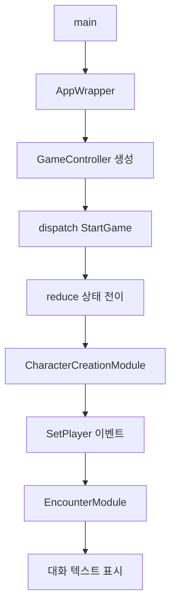
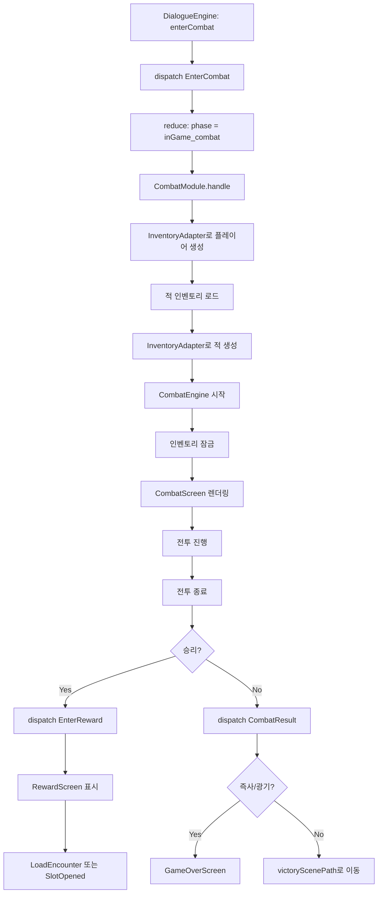
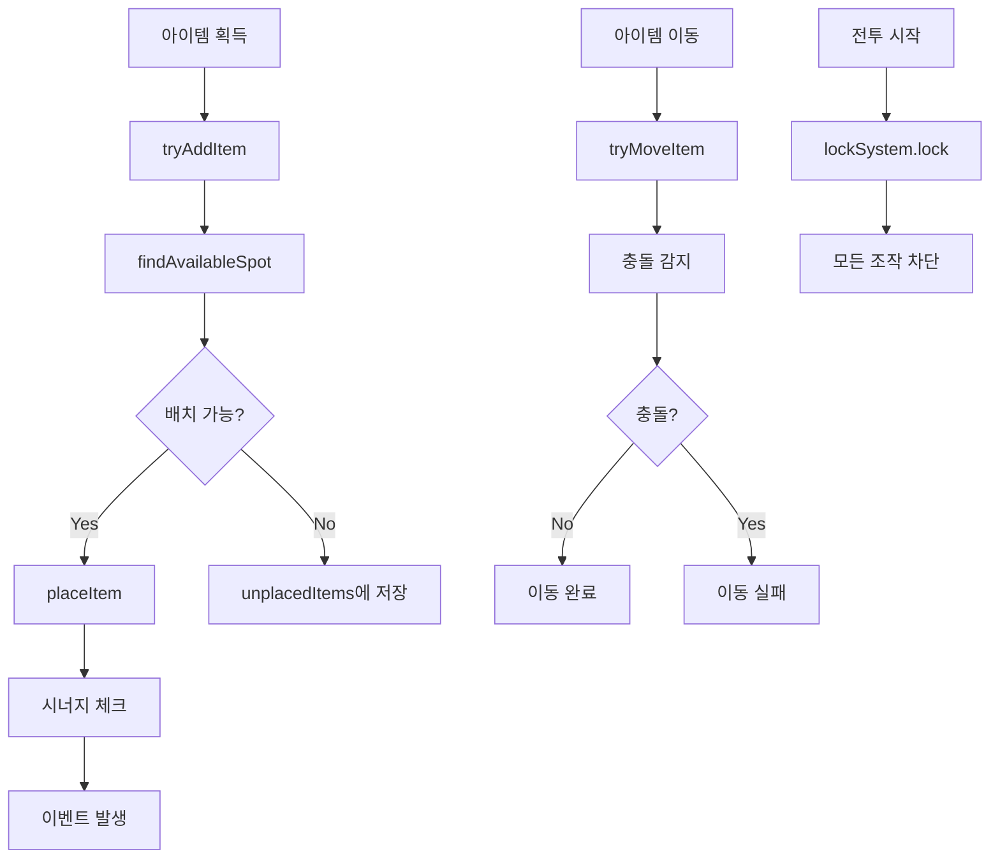
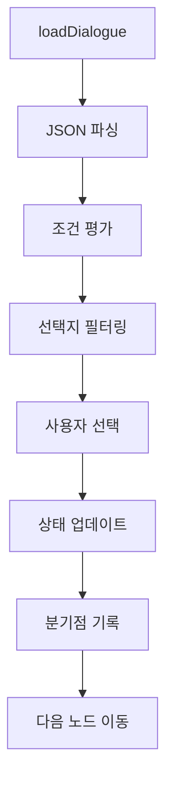

# 코드베이스 분석 문서

> ChatGPT와 Cursor로 협업하기 위한 프로젝트 구조 설명서
> 🤖 마지막 자동 업데이트: 2025-11-19

## 🏷️ 프로젝트 메타데이터

| 항목 | 값 |
|------|-----|
| **버전** | 0.8.0 |
| **현재 스프린트** | Sprint 4 - 시스템 통합 및 안정화 |
| **전체 진행률** | [██░░░░░░░░] 20% |
| **총 파일 수** | 140개 |
| **총 라인 수** | 24,473줄 |
| **모듈 수** | 7개 |
| **테스트 커버리지** | 43% |

## 🔨 현재 진행 중

### 시스템 통합 및 안정화 [P0]

**상태:** 🟢 완료  
**완료일:** 2025-11-19  

**완료된 것:**
- ✅ GameVM에 playerInventory 필드 추가
- ✅ 적 인벤토리 → 전투 스탯 반영
- ✅ 플레이어 인벤토리 → 전투 스탯 연동
- ✅ DialogueEngine 통합 (enterCombat 이벤트)
- ✅ 승리/패배 후 인카운터 경로 처리
- ✅ 보상 화면 구현

---

## 🤖 ChatGPT: 다음 작업 제안

> **분석 결과:** 다음 작업을 권장합니다.

### UI/UX 개선 및 테스트 강화

- **우선순위:** P1
- **예상 시간:** 8.0시간

**권장 작업:**
1. 설정 화면 구현 (2시간)
2. 저장/불러오기 UI 개선 (2시간)
3. 인벤토리 UI 개선 (2시간)
4. E2E 테스트 추가 (2시간)

**관련 파일:**
- `lib/app/app_wrapper.dart`
- `lib/screens/game_screen.dart`
- `lib/save_system.dart`

---

## 📋 작업 백로그

### [P0] 필수 (1.0 베타 전에 반드시 완료)

- [x] **플레이어 인벤토리 → 전투 스탯 연동** ✅
- [x] **게임오버 화면** ✅
- [x] **보상 화면** ✅
- [ ] **저장/불러오기 UI 개선** (50%)

### [P1] 중요 (1.0 정식 전에 완료)

- [ ] **설정 화면 구현** (0%)
- [ ] **DialogueManager Provider 연결** (0%)
- [ ] **인벤토리 UI 개선** (0%)

### [P2] 개선 (나중에 가능)

- [ ] **DialogueManager 클래스 정리** (0%)
- [ ] **테스트 커버리지 60% 달성** (현재 43%)

---

## 📌 코드에서 발견된 TODO

- `lib\app\app_wrapper.dart:204` - TODO: 배경 이미지 선택 구현
- `lib\app\app_wrapper.dart:212` - TODO: 폰트 선택 구현
- `lib\app\app_wrapper.dart:220` - TODO: 색상 테마 선택 구현
- `lib\app\app_wrapper.dart:228` - TODO: 애니메이션 설정 구현
- `lib\combat\item_effect.dart:61` - TODO: 새 이벤트 시스템으로 마이그레이션
- `lib\combat\item_effect.dart:108` - TODO: 새 이벤트 시스템으로 마이그레이션
- `lib\combat\status_effect.dart:1287` - TODO: DoT(지속 피해) 특수 처리 (예: 방어 무시, 회피 무시 등)
- `lib\combat\status_effect.dart:1293` - TODO: 화상 피해 특수 처리
- `lib\combat\status_effect.dart:1296` - TODO: 빙결 피해 특수 처리
- `lib\combat\status_effect.dart:1299` - TODO: 물리 피해 특수 처리
- `lib\combat\status_effect.dart:1302` - TODO: 중독 피해 특수 처리
- `lib\combat\status_effect.dart:1306` - TODO: 기타 피해 타입 처리
- `lib\combat\status_effect.dart:1312` - TODO: 불꽃 오오라 피해 특수 처리
- `lib\combat\status_effect.dart:1314` - TODO: 아이스 필드 피해 특수 처리
- `lib\combat\status_effect.dart:1318` - TODO: 기본 피해 계산 및 적용

... 외 13개

---

## 📋 요약

Flutter 기반 텍스트 RPG 게임입니다. 이벤트 기반 아키텍처와 모듈 패턴을 사용하며, `GameController`가 중앙 허브 역할을 합니다. 

**핵심 기능:**
- 📖 **대화 시스템**: DialogueEngine 기반, 조건부 분기, 커스텀 이벤트 지원
- ⚔️ **전투 시스템**: 실시간 아이템 효과, 인벤토리 기반 스탯 계산
- 🎒 **인벤토리**: 9x6 격자, Footprint 배치, 시너지 시스템
- 📈 **XP/레벨링**: 인카운터 기반 경험치, 마일스톤 시스템
- 🎭 **캐릭터 생성**: 랜덤 특성, 6가지 스탯 (STR, AGI, INT, CHA, VIT, SAN)
- 💾 **저장/불러오기**: 자동 저장, JSON 기반 세이브 시스템
- 🎮 **다중 엔딩**: 조건부 엔딩, 게임오버 시스템

**기술 스택:**
- Provider 패턴으로 상태 관리
- JSON 기반 대화/인카운터 데이터
- 모듈식 아키텍처 (느슨한 결합)
- 이벤트 소싱 패턴

---

## 🚀 1. 진입점 (Entry Point)

**파일:** `lib/main.dart`  
**함수:** `void main()`

### 실행 흐름

1. `main()` → `runApp(MyApp())`
2. `MyApp` → `AppWrapper` 위젯 반환
3. `AppWrapper.build()` → `MultiProvider` 설정
   - `AppState` (화면 네비게이션)
   - `DialogueManager` (대화 관리)
   - `GameController` (게임 상태/이벤트 중앙 허브, 자동으로 `StartGame` 이벤트 발송)
   - `InventorySystem` (9x6 격자 인벤토리)
4. 초기 화면: `StartScreen` → 게임 시작 시 `GameScreen` 전환

---

## 📁 2. 디렉터리 구조

```
d:\text\
├── lib/                              # 메인 소스 코드
│   ├── main.dart                     # 진입점
│   ├── app/                          # 앱 래퍼 및 전역 상태
│   │   └── app_wrapper.dart          # Provider 설정, 화면 라우팅
│   │
│   ├── core/                         # 핵심 게임 로직
│   │   ├── game_controller.dart      # 이벤트 허브, 모듈 조율
│   │   ├── state/                    # 게임 상태 모델
│   │   │   ├── game_state.dart       # GameVM (phase, text, choices, player, combat)
│   │   │   ├── events.dart           # 이벤트 정의 (StartGame, Next, EnterCombat 등)
│   │   │   ├── reducer.dart          # 순수 상태 전이 로직
│   │   │   ├── app_phase.dart        # 게임 페이즈 enum
│   │   │   └── combat_state.dart     # 전투 상태
│   │   ├── character/                # 캐릭터 데이터 모델 (4개 파일)
│   │   ├── item/                     # 아이템 데이터 모델 (16개 파일)
│   │   ├── infra/                    # 인프라 (command queue, phase gate 등)
│   │   ├── xp/                       # XP 시스템 (2개 파일)
│   │   ├── skill_check/              # 스킬 체크 시스템
│   │   ├── milestone/                # 마일스톤 시스템
│   │   └── ending/                   # 엔딩 시스템
│   │
│   ├── modules/                      # 게임 기능 모듈 (DI 패턴)
│   │   ├── character_creation/       # 캐릭터 생성 모듈
│   │   ├── combat/                   # 전투 모듈
│   │   │   ├── combat_module.dart    # 전투 시작/종료 처리
│   │   │   └── controller.dart       # 전투 컨트롤러
│   │   ├── encounter/                # 인카운터 모듈
│   │   │   ├── encounter_module.dart # 인카운터 로드
│   │   │   └── controller.dart       # 인카운터 컨트롤러
│   │   ├── reward/                   # 보상 처리 모듈
│   │   ├── xp/                       # 경험치/마일스톤 모듈
│   │   ├── inventory/                # 인벤토리 모듈
│   │   └── save/                     # 저장 모듈
│   │
│   ├── combat/                       # 전투 시스템 구현체
│   │   ├── combat_system.dart        # 전투 엔진 (타이머 기반)
│   │   ├── combat_engine.dart        # 전투 엔진 (메인)
│   │   ├── character.dart            # 전투용 캐릭터 클래스
│   │   ├── combat_entity.dart        # 전투 엔티티 베이스
│   │   ├── stats.dart                # 전투 스탯
│   │   ├── item.dart                 # 전투 아이템
│   │   ├── item_effect.dart          # 아이템 효과
│   │   ├── effect_type.dart          # 효과 타입 enum
│   │   ├── status_effect.dart        # 상태 효과
│   │   ├── health_system.dart        # 체력 시스템
│   │   ├── combat_conditions.dart    # 전투 조건
│   │   ├── enemy_inventory_loader.dart    # 적 인벤토리 로더
│   │   └── enemy_inventory_generator.dart # 적 인벤토리 생성기
│   │
│   ├── inventory/                    # 인벤토리 시스템 (격자 기반, 18개 파일)
│   │   ├── inventory_system.dart     # 메인 시스템 (428줄)
│   │   ├── inventory_item.dart       # 인벤토리 아이템
│   │   ├── grid_map.dart             # 격자 맵
│   │   ├── vector2_int.dart          # 2D 좌표
│   │   ├── collision_detector.dart   # 충돌 감지
│   │   ├── drag_state.dart           # 드래그 상태
│   │   ├── synergy_system.dart       # 시너지 시스템
│   │   ├── item_acquisition_history.dart  # 아이템 획득 이력
│   │   ├── combat_lock_system.dart   # 전투 중 잠금
│   │   └── bootstrap_noninvasive.dart     # 초기화 부트스트랩
│   │
│   ├── dialogue/                     # 대화 시스템 (18개 파일)
│   │   ├── dialogue_node.dart        # 대화 노드
│   │   ├── dialogue_parser.dart      # JSON 파싱
│   │   ├── condition_evaluator.dart  # 조건 평가
│   │   └── ...                       # 기타 대화 관련 파일
│   ├── dialogue_manager.dart         # 대화 매니저 (메인, 474줄)
│   ├── enhanced_dialogue_manager.dart # 향상된 대화 매니저
│   ├── simple_dialogue_manager_v2.dart # 간단한 대화 매니저 v2
│   │
│   ├── screens/                      # UI 화면 (5개)
│   │   ├── start_screen.dart         # 시작 화면
│   │   ├── game_screen.dart          # 게임 메인 화면 (667줄)
│   │   ├── combat_screen.dart        # 전투 화면
│   │   ├── game_over_screen.dart     # 게임 오버 화면 (즉사/광기)
│   │   └── reward_screen.dart        # 보상 화면 (전투 승리 후)
│   │
│   ├── widgets/                      # 재사용 위젯 (7개)
│   ├── theme/                        # UI 테마
│   │   └── app_theme.dart            # 앱 테마 정의
│   ├── autosave/                     # 자동 저장 시스템
│   │   ├── autosave_system.dart      # 자동 저장 시스템
│   │   ├── autosave_dialogue_manager.dart  # 자동 저장 대화 매니저
│   │   ├── bootstrap.dart            # 대화 매니저 생성 팩토리
│   │   └── deterministic_rng.dart    # 결정론적 난수 생성기
│   │
│   ├── models/                       # 데이터 모델
│   │   └── player_character.dart     # 플레이어 캐릭터 모델
│   ├── services/                     # 서비스 레이어 (2개 파일)
│   ├── storage/                      # 스토리지 레이어 (2개 파일)
│   ├── event_system.dart             # 이벤트 시스템
│   ├── branch_system.dart            # 분기 시스템
│   ├── save_system.dart              # 저장 시스템
│   ├── reward_system.dart            # 보상 시스템
│   ├── trait_system.dart             # 특성 시스템
│   └── trait_effects.dart            # 특성 효과
│
├── assets/                           # 게임 데이터 (JSON, 이미지)
│   ├── dialogue/                     # 대화/인카운터 JSON
│   │   ├── start/                    # 시작 시나리오 (2개 JSON)
│   │   ├── main/                     # 메인 스토리 (18개 JSON, 1개 MD)
│   │   │   ├── chapter/              # 챕터별 스토리
│   │   │   └── story/                # 스토리 데이터
│   │   ├── random/                   # 랜덤 인카운터 (11개 JSON, 1개 MD)
│   │   │   ├── trap/                 # 함정 인카운터
│   │   │   ├── combat/               # 전투 인카운터
│   │   │   └── meeting/              # 만남 인카운터
│   │   ├── encounters/               # 인카운터 정의 (5개 JSON, 5개 MD)
│   │   ├── README.md                 # 대화 시스템 설명
│   │   └── USAGE_EXAMPLES.md         # 사용 예시
│   ├── config/                       # 설정 파일
│   │   └── xp_config.json            # XP 레벨링 설정
│   └── ui/                           # UI 에셋 (이미지)
│       ├── combat/                   # 전투 UI (7개 PNG)
│       ├── UI/                       # 일반 UI (40개 PNG)
│       ├── Retro Inventory/          # 레트로 인벤토리 (247개 PNG)
│       └── ...                       # 기타 UI 에셋
│
├── test/                             # 단위 테스트
│   ├── dialogue/                     # 대화 테스트 (9개)
│   ├── inventory/                    # 인벤토리 테스트 (6개)
│   ├── xp/                           # XP 테스트 (2개)
│   └── ...
│
├── pubspec.yaml                      # 의존성 설정
└── README.md                         # 프로젝트 설명
```

### 디렉터리 책임

| 디렉터리 | 책임 |
|---------|------|
| `lib/core/` | 게임 상태 머신, 이벤트 처리, 순수 비즈니스 로직 |
| `lib/modules/` | 기능별 모듈 (각 모듈은 `GameModule` 인터페이스 구현) |
| `lib/combat/` | 전투 시뮬레이션 엔진 |
| `lib/inventory/` | 격자 기반 인벤토리 (Resident Evil 스타일) |
| `lib/dialogue/` | 대화 트리 파싱 및 조건 평가 |
| `lib/screens/` | Flutter UI 레이어 |
| `assets/` | 게임 콘텐츠 데이터 (JSON) |

---

## 🔧 3. 주요 모듈 (파일/역할/핵심 함수)

### 핵심 인프라

| 파일 | 역할 | 핵심 함수/클래스 |
|------|------|----------------|
| `lib/main.dart` | 앱 진입점 | `main()` |
| `lib/app/app_wrapper.dart` | Provider 설정 및 화면 라우팅 | `build()`, `_buildCurrentScreen()` |
| `lib/core/game_controller.dart` | 이벤트 중앙 허브 | `dispatch(GEvent)`, `_handle()` |
| `lib/core/state/game_state.dart` | 게임 상태 모델 | `GameVM` (phase, text, choices, player, combat) |
| `lib/core/state/events.dart` | 이벤트 정의 | `StartGame`, `Next`, `EnterCombat`, `CombatResult` 등 |
| `lib/core/state/reducer.dart` | 순수 상태 전이 로직 | `reduce(GameVM, GEvent)` |
| `lib/core/infra/command_queue.dart` | 이벤트 직렬 처리 | `CmdQueue` |
| `lib/core/infra/phase_gate.dart` | 페이즈 게이트 | 페이즈 전환 제어 |

### 게임 모듈 (Dependency Injection)

| 파일 | 역할 | 처리 이벤트 | 핵심 함수 |
|------|------|-----------|---------|
| `lib/modules/character_creation/character_creation_module.dart` | 캐릭터 생성 | StartGame | `handle()` - 캐릭터 생성 및 CharacterCreated 이벤트 발생 |
| `lib/modules/combat/combat_module.dart` | 전투 시작/종료 | EnterCombat, CombatResult | `_handleEnterCombat()`, `_handleCombatResult()` |
| `lib/modules/combat/inventory_adapter.dart` | 🆕 인벤토리→전투 스탯 변환 | - | `createPlayerCharacter()`, `createEnemyCharacter()`, `calculateTotalStats()` |
| `lib/modules/encounter/encounter_module.dart` | 인카운터 로드 | CharacterCreated, Next, SlotOpened, LoadEncounter | `handle()` - 대화 엔진을 통한 인카운터 로드 |
| `lib/modules/encounter/encounter_controller.dart` | 인카운터 컨트롤러 | - | `_handleLoadEncounter()`, `_handleNext()`, enterCombat 이벤트 핸들러 |
| `lib/modules/reward/reward_module.dart` | 보상 처리 | EnterReward, LoadEncounter, Next | `handle()` - 보상 화면 표시 및 다음 인카운터 로드 |
| `lib/modules/xp/xp_module.dart` | 경험치/레벨업 | CharacterCreated, EncounterEnded, SlotOpened | `handle()` - XP 증가, 마일스톤 체크 |
| `lib/modules/inventory/inventory_init_module.dart` | 인벤토리 초기화 | CharacterCreated | `handle()` - 시작 아이템 배치 |

**모듈 인터페이스:**
```dart
abstract interface class GameModule {
  Set<AppPhase> get supportedPhases;      // 지원하는 게임 페이즈
  Set<Type> get handledEvents;            // 처리하는 이벤트 타입
  Future<List<GEvent>> handle(GEvent event, GameVM vm);  // 이벤트 처리
}
```

### 전투 시스템

| 파일 | 역할 | 핵심 함수/클래스 |
|------|------|----------------|
| `lib/combat/combat_system.dart` | 전투 엔진 (타이머) | `start()`, `_updateCombat()`, `_startOvertime()` |
| `lib/combat/combat_engine.dart` | 전투 엔진 (메인) | `CombatEngine` |
| `lib/combat/character.dart` | 전투 캐릭터 | `Character`, `CombatStats` |
| `lib/combat/combat_entity.dart` | 전투 엔티티 베이스 | `takeDamage()`, `useItem()`, `heal()` |
| `lib/combat/enemy_inventory_loader.dart` | 적 인벤토리 로드 | `loadFromEncounter()` - Manual/Auto/Hybrid 모드 |
| `lib/combat/enemy_inventory_generator.dart` | 적 인벤토리 생성 | `generateInventory()` - 난이도 기반 생성 |
| `lib/combat/item.dart` | 전투 아이템 | `ItemEffect`, `EffectType` |
| `lib/combat/stats.dart` | 전투 스탯 | `CombatStats` (health, attackPower, accuracy) |
| `lib/combat/health_system.dart` | 체력 시스템 | `HealthSystem` |
| `lib/combat/status_effect.dart` | 상태 효과 | `StatusEffect` |

### 인벤토리 시스템

| 파일 | 역할 | 핵심 함수/클래스 |
|------|------|----------------|
| `lib/inventory/inventory_system.dart` | 메인 시스템 (428줄) | `tryAddItem()`, `tryMoveItem()`, `removeItem()`, `rotateItem()` |
| `lib/inventory/inventory_item.dart` | 인벤토리 아이템 | `InventoryItem` (width, height, footprint) |
| `lib/inventory/grid_map.dart` | 격자 맵 | `placeItem()`, `canPlaceItem()`, `findAvailableSpot()` |
| `lib/inventory/vector2_int.dart` | 2D 좌표 | `Vector2Int` (x, y) |
| `lib/inventory/collision_detector.dart` | 충돌 감지 | `checkCollision()`, `wouldCollide()` |
| `lib/inventory/drag_state.dart` | 드래그 상태 | `DragState` - 아이템 드래그 관리 |
| `lib/inventory/synergy_system.dart` | 시너지 시스템 | `updateSynergies()`, `calculateBonus()` |
| `lib/inventory/combat_lock_system.dart` | 전투 중 잠금 | `lock()`, `unlock()`, `canPerformAction()` |
| `lib/inventory/item_acquisition_history.dart` | 아이템 획득 이력 | `recordAcquisition()`, `getHistory()` |
| `lib/inventory/bootstrap_noninvasive.dart` | 초기화 | `createInventoryWithFootprintPlacement()` |

**인벤토리 특징:**
- 9x6 격자 (54칸)
- Footprint 기반 아이템 배치 (L자형, T자형 등)
- 회전 지원 (90도 단위)
- 시너지 시스템 (인접 아이템 보너스)
- 전투 중 잠금 기능

### 대화 시스템

| 파일 | 역할 | 핵심 함수/클래스 |
|------|------|----------------|
| `lib/dialogue_manager.dart` | 대화 관리 (474줄) | `loadDialogue()`, `saveGame()`, `loadGame()` |
| `lib/enhanced_dialogue_manager.dart` | 향상된 대화 매니저 | 확률 기반 선택지, 스킬 체크 |
| `lib/dialogue/dialogue_node.dart` | 대화 노드 | `DialogueNode` 모델 |
| `lib/dialogue/dialogue_parser.dart` | JSON 파싱 | `parse()` - JSON을 대화 트리로 변환 |
| `lib/dialogue/condition_evaluator.dart` | 조건 평가 | `evaluate()` - 조건식 평가 |

**대화 시스템 특징:**
- JSON 기반 대화 데이터
- 조건부 분기 (스탯, 아이템, 플래그)
- 분기점 기록 (`BranchSystem`)
- 자동 저장/불러오기

### UI 화면

| 파일 | 역할 | 핵심 함수 |
|------|------|---------|
| `lib/screens/start_screen.dart` | 시작 화면 | `build()` - 게임 시작/불러오기 버튼 |
| `lib/screens/game_screen.dart` | 게임 메인 화면 (667줄) | `_buildCharacterInfoArea()`, `_buildStoryArea()`, `_buildChoicesList()` |
| `lib/screens/combat_screen.dart` | 전투 화면 | `_buildCombatUI()` - 전투 UI 렌더링 |
| `lib/screens/game_over_screen.dart` | 게임 오버 화면 | `build()` - 즉사/광기 화면 (재시작 버튼) |
| `lib/screens/reward_screen.dart` | 보상 화면 | `build()` - 전투 승리 후 보상 표시 |

### 데이터 모델

| 파일 | 역할 | 핵심 클래스 |
|------|------|-----------|
| `lib/core/character/character_models.dart` | 플레이어 모델 | `Player` (strength, agility, intelligence, charisma, vitality, sanity) |
| `lib/core/state/game_state.dart` | 게임 상태 | `GameVM` (phase, text, choices, player, combat, **playerInventory**) |
| `lib/core/state/combat_state.dart` | 전투 상태 | `CombatState` (player, enemy, engine, won, finished) |
| `lib/models/player_character.dart` | 플레이어 캐릭터 | `PlayerCharacter` |
| `lib/core/state/events.dart` | 이벤트 정의 | 20+ 이벤트 클래스 (StartGame, Next, EnterCombat, etc.) |

---

## 🔄 4. 데이터·이벤트 흐름

### 주요 이벤트 목록

| 이벤트 | 발생 시점 | 처리 모듈 | 설명 |
|--------|---------|---------|------|
| `StartGame` | 앱 시작 | CharacterCreationModule | 게임 시작 트리거 |
| `CharacterCreated` | 캐릭터 생성 완료 | EncounterModule, XpModule, InventoryInitModule | 캐릭터 생성 완료 알림 |
| `Next` | 사용자가 다음 클릭 | EncounterModule, RewardModule | 대화/인카운터 진행 |
| `Choose` | 선택지 선택 | - | 대화 선택지 선택 |
| `EnterCombat` | 전투 시작 | CombatModule | 전투 진입 (payload: 적 정보) |
| `CombatResult` | 전투 종료 | CombatModule | 전투 결과 (won: true/false) |
| `EnterReward` | 보상 화면 진입 | RewardModule | 전투 승리 후 보상 표시 |
| `LoadEncounter` | 특정 인카운터 로드 | EncounterModule, RewardModule | 인카운터 파일 + 씬 ID 지정 로드 |
| `EncounterLoaded` | 인카운터 로드 완료 | - | UI에 텍스트 표시 |
| `EncounterEnded` | 인카운터 종료 | XpModule | XP 정산 트리거 |
| `SlotOpened` | 다음 슬롯 오픈 | EncounterModule, XpModule | 다음 인카운터 선택 |
| `MilestoneReached` | 마일스톤 도달 | - | 레벨업/업적 달성 |
| `ShowEnding` | 엔딩 표시 | - | 게임 종료 |
| `RestartNewGame` | 새 게임 시작 | - | 게임 재시작 |

### 게임 시작 흐름



1. `main()` → `AppWrapper` 생성 → `GameController` Provider 등록
2. `GameController` 생성자 → `Future.microtask(() => dispatch(StartGame()))`
3. `GameController._handle(StartGame)` → `reduce()` 상태 전이 → 모듈들에게 이벤트 전파
4. `CharacterCreationModule.handle(StartGame)` → 캐릭터 생성 → `SetPlayer` 이벤트 발생
5. `EncounterModule` → 인카운터 로드 → 대화 텍스트 반환
6. UI: `GameScreen` 렌더링 (캐릭터 정보 + 스토리 영역)

### 전투 흐름



1. **전투 진입**: DialogueEngine의 `enterCombat` 이벤트 → `dispatch(EnterCombat(payload, victoryPath, defeatPath))`
2. **상태 전이**: `reduce()` → `phase = AppPhase.inGame_combat`, victoryScenePath/defeatScenePath 저장
3. **전투 준비** (`CombatModule.handle`):
   - `InventoryAdapter.createPlayerCharacter()` → 플레이어 인벤토리 → 전투 스탯 계산
   - `EnemyInventoryLoader.loadFromEncounter()` → 적 인벤토리 로드 (Manual/Auto/Hybrid)
   - `InventoryAdapter.createEnemyCharacter()` → 적 인벤토리 → 전투 스탯 계산
   - `CombatEngine` 시작 (100ms 틱)
   - 인벤토리 잠금 (`lockSystem.lock()`)
4. **전투 UI**: `GameScreen` → `CombatScreen` 렌더링
5. **전투 진행**: 100ms마다 아이템 효과 적용, 체력 계산
6. **전투 종료**:
   - **승리 시**: `dispatch(EnterReward)` → `RewardScreen` 표시 → victoryScenePath로 이동 또는 SlotOpened
   - **패배 시**: `dispatch(CombatResult)` → 패널티 적용 → 즉사/광기 체크 → defeatScenePath로 이동 또는 GameOver
7. **정리**: 인벤토리 잠금 해제

### 인벤토리 흐름



1. **아이템 획득** → `inventorySystem.tryAddItem(item)`
2. `GridMap.findAvailableSpot()` → 자동 배치 시도
3. 배치 성공 → `gridMap.placeItem()`, 실패 시 아이템은 `unplacedItems`에 저장
4. **아이템 이동** → `tryMoveItem(item, newX, newY)` → `CollisionDetector.checkCollision()`
5. **시너지 체크** → `SynergySystem.updateSynergies()` → 인접 아이템 보너스 계산
6. **전투 시작** → `lockSystem.lock()` → 모든 조작 차단
7. **전투 종료** → `lockSystem.unlock()` → 조작 가능

### 대화 흐름



1. `DialogueManager.loadDialogue(jsonPath)` → JSON 파싱
2. `EventSystem.state` (stats, items, flags) 기반으로 조건 평가
3. `BranchSystem` → 분기점 기록
4. 선택지 선택 → 상태 변경 (스탯/아이템/플래그 업데이트) → 다음 노드 이동
5. 자동 저장 (`AutosaveSystem`)

### 모듈 간 통신 (이벤트 기반)

```
┌─────────────────────────────────────────┐
│         GameController (허브)            │
│  - dispatch(GEvent)                     │
│  - CmdQueue로 직렬 처리                  │
│  - reduce() 상태 전이                    │
│  - 모듈들에게 이벤트 전파                 │
└─────────────┬───────────────────────────┘
              │
    ┌─────────┴─────────────────┐
    │                           │
    ▼                           ▼
┌────────────┐            ┌────────────┐
│ Module A   │            │ Module B   │
│ - handle() │            │ - handle() │
│ - return   │            │ - return   │
│   [Event]  │            │   [Event]  │
└────────────┘            └────────────┘
```

**특징:**
- **중앙 집중식**: 모든 이벤트는 `GameController.dispatch()`로 전송
- **느슨한 결합**: 모듈은 `supportedPhases`와 `handledEvents`만 선언
- **직렬 처리**: `CmdQueue`로 이벤트 순차 처리 (race condition 방지)
- **사이드 이펙트**: 모듈이 새 이벤트 반환 → 재귀적으로 `dispatch()`

---

## 💡 5. ChatGPT를 위한 프롬프트 예시

### 예시 1: 특정 기능 파일 찾기

```
"전투 중 인벤토리가 잠기는 기능이 어디 있는지 파일만 열어줘"
```

**ChatGPT 응답 예상:**
> `lib/inventory/combat_lock_system.dart` 파일입니다.
> 이 파일은 `CombatLockSystem` 클래스를 정의하고,
> `lock()` / `unlock()` / `canPerformAction()` 메서드를 제공합니다.
> 전투 시작 시 `CombatModule`이 `lockSystem.lock()`을 호출합니다.

**관련 파일:**
- `lib/inventory/combat_lock_system.dart` (잠금 시스템)
- `lib/modules/combat/combat_module.dart` (잠금 호출)

---

### 예시 2: 모듈 리팩터링

```
"XP 모듈만 리팩터링해줘. 레벨업 시 알림 메시지를 이벤트로 발생시키도록 수정"
```

**ChatGPT 응답 예상:**
> `lib/modules/xp/xp_module.dart` 파일을 수정하겠습니다.
> 
> 1. `lib/core/state/events.dart`에 `LevelUpNotification` 이벤트 추가
> 2. `xp_module.dart`의 `handle()` 메서드에서 레벨업 감지 시 새 이벤트 반환
> 3. (선택) `NotificationModule` 생성 → UI 알림 처리

**수정할 파일:**
- `lib/core/state/events.dart` (이벤트 정의)
- `lib/modules/xp/xp_module.dart` (레벨업 로직)
- (선택) `lib/modules/notification/notification_module.dart` (새 파일)

---

### 예시 3: 하드코딩 제거

```
"combat_module.dart에서 하드코딩된 적 스탯을 config 파일로 빼줘"
```

**ChatGPT 응답 예상:**
> 1. `assets/config/enemy_config.json` 파일 생성 (적 이름별 스탯 정의)
> 2. `lib/combat/enemy_config_loader.dart` 추가 (JSON 로더)
> 3. `lib/modules/combat/combat_module.dart` 수정:
>    - `_handleEnterCombat()`에서 하드코딩된 스탯(80, 15, 70) 제거
>    - `EnemyConfigLoader.loadStats(enemyName)` 호출로 대체
> 4. `pubspec.yaml`에 새 에셋 경로 추가

**수정할 파일:**
- `assets/config/enemy_config.json` (새 파일)
- `lib/combat/enemy_config_loader.dart` (새 파일)
- `lib/modules/combat/combat_module.dart` (리팩터링)
- `pubspec.yaml` (에셋 경로 추가)

---

## 📦 부록: 주요 의존성 (pubspec.yaml)

```yaml
dependencies:
  flutter: sdk
  provider: ^6.1.1               # 상태 관리
  path_provider: ^2.1.2          # 파일 시스템 (세이브 파일)
  json_annotation: ^4.8.1        # JSON 직렬화
  cupertino_icons: ^1.0.8        # iOS 아이콘

dev_dependencies:
  flutter_test: sdk
  build_runner: ^2.4.8           # 코드 생성
  json_serializable: ^6.7.1      # JSON 시리얼라이저
  flutter_lints: ^5.0.0          # 린트
```

---

## 📚 추가 문서

프로젝트 루트에 구현 요약 문서들이 있습니다:

| 문서 | 설명 | 상태 |
|------|------|------|
| `INVENTORY_COMBAT_INTEGRATION_COMPLETE.md` | 🆕 **인벤토리-전투 통합 완료 문서** | ✅ 최신 |
| `IMPLEMENTATION_COMBAT_INVENTORY_STATS.md` | 인벤토리 스탯 반영 (적/플레이어) | ✅ 완료 |
| `IMPLEMENTATION_SUMMARY_XP.md` | XP 시스템 통합 | ✅ 완료 |
| `IMPLEMENTATION_SUMMARY_COMBAT_UI.md` | 전투 UI 구현 | ✅ 완료 |
| `IMPLEMENTATION_SUMMARY_COMBAT_INVENTORY_INTEGRATION.md` | 전투-인벤토리 연동 | ✅ 완료 |
| `IMPLEMENTATION_SUMMARY_METADATA_XP.md` | 메타데이터 XP 시스템 | ✅ 완료 |
| `IMPLEMENTATION_SUMMARY_CHAPTER_RESTRUCTURE.md` | 챕터 구조 개편 | ✅ 완료 |
| `CACHE_CLEARED.md` | 캐시 클리어 가이드 | 📖 참고 |
| `INITIALIZATION_COMPLETE.md` | 초기화 완료 | 📖 참고 |
| `THEME_CUSTOMIZATION.md` | 테마 커스터마이징 | 📖 참고 |

### 대화 시스템 문서

| 문서 | 경로 | 설명 |
|------|------|------|
| `README.md` | `assets/dialogue/` | 대화 시스템 전체 가이드 |
| `USAGE_EXAMPLES.md` | `assets/dialogue/` | 사용 예시 |
| `DIALOGUE_FORMAT_GUIDE.md` | `assets/dialogue/encounters/` | 인카운터 포맷 가이드 |
| `ENEMY_INVENTORY_SCHEMA.md` | `assets/dialogue/encounters/` | 적 인벤토리 스키마 |
| `COMPLETE_SCHEMA.json` | `assets/dialogue/encounters/` | 완전한 JSON 스키마 |

---

## 🎯 아키텍처 패턴

### 이벤트 기반 아키텍처 (Event-Driven)

- **이벤트 소싱**: 모든 게임 로직은 이벤트로 표현
- **CQRS 패턴**: `reduce()` (순수 상태 전이) + 모듈 (사이드 이펙트)
- **커맨드 큐**: `CmdQueue`로 이벤트 직렬화

### 모듈 패턴 (Plugin Architecture)

- **의존성 주입**: `GameController`에 모듈 리스트 주입
- **인터페이스 분리**: `GameModule` 인터페이스
- **느슨한 결합**: 모듈은 서로를 모르고 이벤트만 주고받음

### 상태 관리 패턴

- **Provider**: Flutter 전역 상태 관리
- **Immutable State**: `GameVM`은 불변 객체
- **Pure Functions**: `reduce()` 순수 함수

---

## 🚧 현재 작업 중/TODO

### ✅ 최근 완료된 작업

- [x] 적 인벤토리 → 전투 스탯 반영 (`inventory_adapter.dart`)
- [x] 플레이어 인벤토리 → 전투 캐릭터 연결 (GameVM에 `playerInventory` 필드 추가)
- [x] 게임 오버 화면 구현 (`game_over_screen.dart`)
- [x] 보상 화면 구현 (`reward_screen.dart`)
- [x] DialogueEngine 통합 (enterCombat 커스텀 이벤트)
- [x] 승리/패배 후 인카운터 경로 처리 (victoryScenePath, defeatScenePath)

### 🔄 진행 중

- [ ] 저장/불러오기 UI 개선 (50%)

### 📝 다음 작업

- [ ] 설정 화면 구현
- [ ] 인벤토리 UI 개선
- [ ] DialogueManager Provider 연결
- [ ] E2E 테스트 추가

---

## 📞 연락처

이 문서를 ChatGPT/Cursor에게 제공하면, 프로젝트 전체 구조를 빠르게 파악하고 구체적인 작업을 시작할 수 있습니다.

**최초 작성일:** 2025-11-02  
**최종 업데이트:** 2025-11-19  
**문서 버전:** 2.0.0  
**프로젝트 버전:** 0.8.0

---

## 🔍 빠른 참조

### 주요 클래스 찾기

- **게임 상태**: `lib/core/state/game_state.dart` → `GameVM`
- **이벤트**: `lib/core/state/events.dart` → 20+ 이벤트 클래스
- **게임 컨트롤러**: `lib/core/game_controller.dart` → `GameController`
- **전투 모듈**: `lib/modules/combat/combat_module.dart`
- **인벤토리 시스템**: `lib/inventory/inventory_system.dart`
- **대화 엔진**: `lib/dialogue/dialogue_engine.dart`
- **인벤토리 어댑터**: `lib/modules/combat/inventory_adapter.dart`

### 새 기능 추가 가이드

1. **새 이벤트 추가**: `lib/core/state/events.dart`에 이벤트 클래스 추가
2. **새 모듈 추가**: `lib/modules/` 아래 모듈 생성 → `GameModule` 인터페이스 구현
3. **새 화면 추가**: `lib/screens/` 아래 화면 생성 → `AppWrapper`에 라우팅 추가
4. **새 인카운터**: `assets/dialogue/`에 JSON 추가 → index.json 업데이트

### 문제 해결

- **전투가 시작 안 됨**: `EncounterController._registerCustomHandlers()` 확인
- **인벤토리 스탯 반영 안 됨**: `InventoryAdapter.calculateTotalStats()` 확인
- **저장/불러오기 오류**: `SaveSystem` 및 `GameVM` 직렬화 확인
- **모듈이 이벤트 안 받음**: `supportedPhases`와 `handledEvents` 확인


